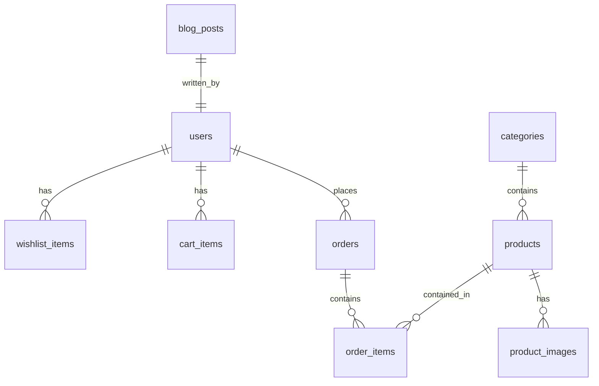

# 🛒 CozyCart - Premium Full-Stack E-Commerce Platform

<p align="center">
  
</p>

<h3 align="center">Shop Cozy. Live Better.</h3>

<p align="center">
  <a href="https://spring.io/projects/spring-boot"></a>
  <a href="https://react.dev/"></a>
  <a href="https://tailwindcss.com/"></a>
  <a href="https://vite.dev/"></a>
  <a href="https://www.mysql.com/"></a>
  <a href="https://docker.com/"></a>
</p>

---

## 🌟 Introduction

Welcome to **CozyCart** (Backend codename: **Stay Home**), a high-performance, modern, and secure full-stack B2C E-Commerce web application specialized in clothing and seasonal collections.

The platform combines a **Java Spring Boot 3.x** REST API server (using stateless JWT security, Spring Data JPA, and MySQL) with a state-of-the-art **React 19** frontend styled with **Tailwind CSS v4** and bundled with **Vite**. 

---

## 🔁 System Architecture & Data Flow

CozyCart leverages a classic N-tier architectural model utilizing Data Transfer Objects (DTOs) to secure and decouple the database layer from the client-facing APIs.

### Business Logic Pipeline
```
[ Customer Browser ] ────► [ Controller ] ────► [ Service ] ────► [ Repository ] ────► [ MySQL DB ]
                                                                                           │
[ Client HTTP Response ] ◄─── [ Controller ] ◄──── [ Service ] ◄──── [ Repository ] ◄──────┘
```

### Layer Mappings
```
  [ Client (React App) ]
         │  ▲
         ▼  │  (JSON Requests & Responses via Axios / JWT headers)
     [ Controller ]
         │  ▲
         ▼  │  (Data mapping via Request / Response DTOs)
      [ Service ]
         │  ▲
         ▼  │  (Business Logic & Transaction Management via JPA Entities)
    [ Repository ]
         │  ▲
         ▼  │  (SQL queries managed by Hibernate and HikariCP connection pool)
     [ Database ]
```

---

## ⚡ Key Features

### 👤 Customer (User) Portal
*   **Secure Authentication:** User registration, password encryption using BCrypt, and secure JWT-based stateless logins.
*   **Discovery Engine:** Browse product categories, search item names, and view detailed sizing options.
*   **Smart Shopping Cart:** Responsive, persistent cart managing quantities and sizing options.
*   **Personal Wishlist:** Quick wishlist additions and tracking of favorite clothing articles.
*   **Checkout & Order History:** Streamlined order processing for Cash on Delivery (COD) with complete order history tracking.
*   **Interactive UI:** High-fidelity user experience built using Tailwind CSS v4, custom fonts, fluid animations, and real-time toast alerts.

### 🛠️ Administrative Dashboard
*   **Management Panel:** Complete CRUD (Create, Read, Update, Delete) operations for Products and Categories.
*   **Order Fulfillment:** Real-time monitoring of customer checkouts and step-by-step status transitions (e.g. `PENDING` ➔ `PROCESSING` ➔ `SHIPPED` ➔ `DELIVERED`).
*   **User Auditing:** Browse registered profiles, contact tickets, and newsletter subscriptions.
*   **File Manager:** Product image uploads configured straight to local server paths.

---

## 📁 Repository Structure

```text
projectworktwo/
├── backend/                        # Spring Boot Java Backend
│   ├── src/
│   │   ├── main/
│   │   │   ├── java/com/stayhome/  # Java Application source
│   │   │   │   ├── config/         # System configurations (CORS, Security)
│   │   │   │   ├── controller/     # REST Endpoints
│   │   │   │   ├── dto/            # API Data Transfer Objects (Request/Response)
│   │   │   │   ├── entity/         # JPA Entity Classes
│   │   │   │   ├── exception/      # Global Exception Handlers
│   │   │   │   ├── mapper/         # Entities <-> DTO converters
│   │   │   │   ├── repository/     # JPA database access repositories
│   │   │   │   ├── security/       # JWT Filters & Auth Entry points
│   │   │   │   └── service/        # Transactional Business Logic
│   │   │   └── resources/          # Configuration files & SQL scripts
│   │   └── test/                   # JUnit & Spring Boot test cases
│   ├── pom.xml                     # Maven Dependencies (Spring Boot 3.2.5)
│   ├── Dockerfile                  # Container configurations
│   └── stayhome_postman_collection.json # Local API Testing Suite
│
├── src/                            # React Frontend Source (Vite build)
│   ├── components/                 # Reusable UI parts & layouts
│   ├── pages/                      # Page components (Catalog, Cart, Admin Panel)
│   ├── App.jsx                     # Route configurations (React Router DOM v7)
│   └── main.jsx                    # Root entry point
│
├── public/                         # Public static frontend files
├── docs/                           # Detailed system specification docs
├── images/                         # Project logos, banners, and static screenshots
├── package.json                    # Node dependencies and scripts
└── vite.config.js                  # Vite compiler configurations
```

---

## 🛠️ Technology Stack

| Tier | Technology | Description |
| :--- | :--- | :--- |
| **Backend** | [Spring Boot 3.2.5](https://spring.io/projects/spring-boot) | Core application framework. |
| | [Spring Security 6](https://spring.io/projects/spring-security) | Stateless JWT security & role-based route protection. |
| | [Spring Data JPA / Hibernate](https://spring.io/projects/spring-data-jpa) | Relational database mapping and object storage. |
| | [Lombok](https://projectlombok.org/) | Eliminates boilerplates (Getters, Setters, Builders). |
| **Frontend**| [React 19.x](https://react.dev/) | Component-driven frontend structure. |
| | [Vite 8.x](https://vite.dev/) | Superfast module bundler and development server. |
| | [React Router DOM v7](https://reactrouter.com/) | Client-side application routing. |
| | [TanStack React Query v5](https://tanstack.com/query) | State-management, cache, and HTTP query resolver. |
| | [Tailwind CSS v4](https://tailwindcss.com/) | Rapid, custom design layout engine. |
| **Database**| [MySQL 8.x](https://www.mysql.com/) | Relational database schema engine. |

---

## 🚀 Getting Started & Local Setup

### Prerequisites
Before running the application, make sure you have the following installed:
*   [Java Development Kit (JDK) 17](https://adoptium.net/temurin/releases/?version=17)
*   [Node.js](https://nodejs.org/) (v18 or higher)
*   [MySQL Server](https://www.mysql.com/downloads/)
*   [Maven](https://maven.apache.org/) (optional, Maven wrapper `./mvnw` is packaged in the root)

---

### Step 1: Database Setup
1. Open your MySQL command-line client or administration interface (like DBeaver or MySQL Workbench).
2. Execute the following statement to create the database:
   ```sql
   CREATE DATABASE stayhome_db;
   ```
3. Open the backend configuration file: [application.properties](file:///d:/Mahfuz/Project/projectworktwo/backend/src/main/resources/application.properties) and update your database credentials:
   ```properties
   spring.datasource.username=your_mysql_username
   spring.datasource.password=your_mysql_password
   ```

---

### Step 2: Run the Spring Boot Backend
1. Open your terminal and navigate to the backend directory:
   ```bash
   cd backend
   ```
2. Build and run the application:
   * **Windows (PowerShell/CMD):**
     ```cmd
     mvnw.cmd spring-boot:run
     ```
   * **Linux / MacOS:**
     ```bash
     chmod +x mvnw
     ./mvnw spring-boot:run
     ```
3. The server will start and start listening for HTTP requests on port **`8081`**.
4. The database tables will be automatically generated by Hibernate on startup.

---

### Step 3: Run the React Frontend
1. Open a new terminal window in the project root directory.
2. Install the frontend dependencies:
   ```bash
   npm install
   ```
3. Set up the local environment configuration. Create a `.env` file in the root directory:
   ```env
   VITE_API_BASE_URL=http://localhost:8081
   ```
4. Start the Vite development compiler server:
   ```bash
   npm run dev
   ```
5. Open your browser and navigate to the URL shown (typically `http://localhost:5173`).

---

## 🐳 Docker Deployment (Containerization)

To package, run, and ship the backend inside a Docker container:

1. Build the dockerized backend image:
   ```bash
   docker build -t cozycart-backend ./backend
   ```
2. Start the container while linking database host names and configurations:
   ```bash
   docker run -p 8081:8081 \
     -e DB_URL=jdbc:mysql://host.docker.internal:3306/stayhome_db \
     -e DB_USERNAME=root \
     -e DB_PASSWORD=your_mysql_password \
     cozycart-backend
   ```

---

## 🗄️ Relational Database Schema Model

Below is the layout of the tables generated in MySQL:



### Table Reference Highlights
*   **`users`**: Customer profiles containing credential passwords hashed with BCrypt and Role specifications (`CUSTOMER` or `ADMIN`).
*   **`products`**: Inventory catalog listing names, descriptions, pricing, custom sizing strings, and arrival statuses.
*   **`orders` & `order_items`**: Manages purchased items with snapshotted pricing, status keys (`PENDING`, `SHIPPED`, etc.), and shipping addresses.
*   **`cart_items` & `wishlist_items`**: Keeps records of client cart counts and bookmark states for personalized experiences.

---

## 🔒 Security & Endpoint Indexes

All endpoints utilize standard JSON response structures. Protected endpoints require the token structure passed in headers: `Authorization: Bearer <JWT_TOKEN>`.

### Authentication Endpoints
| HTTP Method | URL | Access | Description |
| :--- | :--- | :--- | :--- |
| **POST** | `/api/auth/register` | Public | Register user accounts. |
| **POST** | `/api/auth/login` | Public | Login to retrieve JWT tokens. |
| **GET** | `/api/auth/profile` | Protected | Fetch current profile metadata. |

### Shopping Catalog
| HTTP Method | URL | Access | Description |
| :--- | :--- | :--- | :--- |
| **GET** | `/api/categories` | Public | Browse organized categories. |
| **GET** | `/api/products` | Public | Search/Filter catalog list. |
| **GET** | `/api/products/{id}` | Public | Detailed view of product details. |

### Shopping Operations
| HTTP Method | URL | Access | Description |
| :--- | :--- | :--- | :--- |
| **GET** | `/api/cart` | Protected | Load user cart selections. |
| **POST** | `/api/cart/add` | Protected | Insert new product/sizes to cart. |
| **DELETE** | `/api/cart/remove` | Protected | Drop individual catalog item. |
| **POST** | `/api/orders/place` | Protected | Confirm order and check out. |

For a comprehensive API list and schema definitions, please refer to the detailed documents located in [docs/API_SPEC.md](file:///d:/Mahfuz/Project/projectworktwo/docs/API_SPEC.md) and [docs/DATABASE.md](file:///d:/Mahfuz/Project/projectworktwo/docs/DATABASE.md).

---

## 🎨 Project Visuals

Here is what CozyCart looks like:

<p align="center">
  
</p>

---

## 🤝 Contribution Guidelines

We highly welcome feedback, reports, and code contributions to **CozyCart**.
1. Fork the repository.
2. Create a feature branch: `git checkout -b feature/NewFeature`.
3. Read the [docs/DEVELOPMENT_RULES.md](file:///d:/Mahfuz/Project/projectworktwo/docs/DEVELOPMENT_RULES.md) for coding styles.
4. Commit your changes and submit a pull request!

---

## 📄 License
This project is licensed under the MIT License - see the LICENSE details for info.
