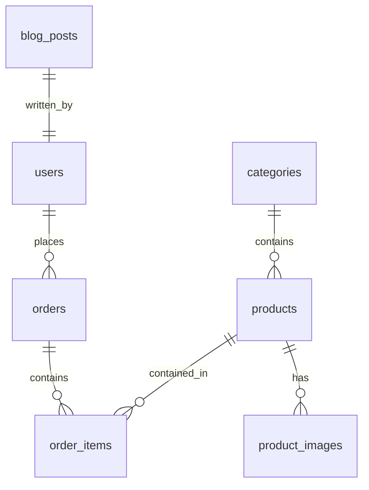

# Stay Home E-Commerce - Database Design

This document details the relational schema design implemented in MySQL for the Stay Home application.

---

## 🗺️ Entity Relationship Layout



---

## 🔒 Role Mapping & Architecture

We implement a single Role representation using a Java Enum structure mapped directly as a String value in the `users` table:

```java
public enum Role {
    CUSTOMER,
    ADMIN
}
```

This maps to a single column `role` (VARCHAR or ENUM choice) inside the `users` table. This avoids creating unnecessary lookup tables, making user checks clean and fast.

---

## 🗄️ Tables and Columns Reference

### 1. `users` Table
Stores customer and administrator profile details.
* **id** (`BIGINT`, PK, Auto-Increment)
* **name** (`VARCHAR(100)`, NOT NULL)
* **email** (`VARCHAR(100)`, UNIQUE, NOT NULL)
* **password** (`VARCHAR(255)`, NOT NULL) - BCrypt encrypted
* **phone** (`VARCHAR(20)`)
* **address** (`TEXT`)
* **role** (`ENUM('CUSTOMER', 'ADMIN')`, DEFAULT 'CUSTOMER')
* **created_at** (`TIMESTAMP`, NOT NULL)
* **updated_at** (`TIMESTAMP`)

### 2. `categories` Table
Organizes products.
* **id** (`BIGINT`, PK, Auto-Increment)
* **name** (`VARCHAR(100)`, UNIQUE, NOT NULL)
* **description** (`TEXT`)

### 3. `products` Table
Stores core product data.
* **id** (`BIGINT`, PK, Auto-Increment)
* **category_id** (`BIGINT`, FK referencing `categories(id)`)
* **name** (`VARCHAR(255)`, NOT NULL)
* **description** (`TEXT`)
* **price** (`DECIMAL(10,2)`, NOT NULL)
* **stock** (`INT`, DEFAULT 0)
* **sizes** (`VARCHAR(255)`) - Comma separated options, e.g. "Small,Large,XL,XXL"
* **is_featured** (`BIT/BOOLEAN`, DEFAULT 0)
* **is_new_arrival** (`BIT/BOOLEAN`, DEFAULT 0)
* **rating** (`DECIMAL(2,1)`, DEFAULT 5.0)
* **created_at** (`TIMESTAMP`, NOT NULL)

### 4. `product_images` Table
Allows multiple images per product.
* **id** (`BIGINT`, PK, Auto-Increment)
* **product_id** (`BIGINT`, FK referencing `products(id)`)
* **image_url** (`VARCHAR(255)`, NOT NULL)
* **is_primary** (`BIT/BOOLEAN`, DEFAULT 0)

### 5. `orders` Table
Tracks user orders and shipping details.
* **id** (`BIGINT`, PK, Auto-Increment)
* **user_id** (`BIGINT`, FK referencing `users(id)`)
* **order_date** (`TIMESTAMP`, NOT NULL)
* **updated_at** (`TIMESTAMP`)
* **status** (`VARCHAR(30)`, DEFAULT 'PENDING') - Stores statuses: PENDING, CONFIRMED, PROCESSING, SHIPPED, DELIVERED, CANCELLED
* **subtotal** (`DECIMAL(10,2)`, NOT NULL)
* **delivery_charge** (`DECIMAL(10,2)`, NOT NULL)
* **total_amount** (`DECIMAL(10,2)`, NOT NULL)
* **shipping_address** (`TEXT`, NOT NULL)
* **phone** (`VARCHAR(20)`, NOT NULL)
* **payment_method** (`VARCHAR(30)`, DEFAULT 'COD') - Stores enum values: COD, CREDIT_CARD, DEBIT_CARD, MOBILE_BANKING, ONLINE_TRANSFER
* **payment_status** (`VARCHAR(20)`, DEFAULT 'UNPAID') - Stores enum values: UNPAID, PAID, FAILED, REFUNDED

### 6. `order_items` Table
Itemizes items within each order.
* **id** (`BIGINT`, PK, Auto-Increment)
* **order_id** (`BIGINT`, FK referencing `orders(id)`)
* **product_id** (`BIGINT`, FK referencing `products(id)`)
* **size** (`VARCHAR(20)`, NOT NULL)
* **quantity** (`INT`, NOT NULL)
* **price** (`DECIMAL(10,2)`, NOT NULL) - Snapshotted price at checkout

### 7. `blog_posts` Table
Backs the Blog page.
* **id** (`BIGINT`, PK, Auto-Increment)
* **title** (`VARCHAR(255)`, NOT NULL)
* **content** (`TEXT`, NOT NULL)
* **image_url** (`VARCHAR(255)`)
* **author** (`VARCHAR(100)`, DEFAULT 'Admin')
* **created_at** (`TIMESTAMP`, NOT NULL)

### 8. `contact_messages` Table
Captures support tickets and messages.
* **id** (`BIGINT`, PK, Auto-Increment)
* **name** (`VARCHAR(100)`, NOT NULL)
* **email_or_phone** (`VARCHAR(100)`, NOT NULL)
* **message** (`TEXT`, NOT NULL)
* **created_at** (`TIMESTAMP`, NOT NULL)

### 9. `newsletter_subscribers` Table
Maintains emails registered through the newsletter.
* **id** (`BIGINT`, PK, Auto-Increment)
* **email** (`VARCHAR(100)`, UNIQUE, NOT NULL)
* **subscribed_at** (`TIMESTAMP`, NOT NULL)

### 10. `cart_items` Table
Stores customer selections in their shopping cart.
* **id** (`BIGINT`, PK, Auto-Increment)
* **user_id** (`BIGINT`, FK referencing `users(id)`)
* **product_id** (`BIGINT`, FK referencing `products(id)`)
* **size** (`VARCHAR(20)`, NOT NULL)
* **quantity** (`INT`, NOT NULL)
* **created_at** (`TIMESTAMP`, NOT NULL)
* **updated_at** (`TIMESTAMP`)

### 11. `wishlist_items` Table
Stores customer wishlist entries.
* **id** (`BIGINT`, PK, Auto-Increment)
* **user_id** (`BIGINT`, FK referencing `users(id)`)
* **product_id** (`BIGINT`, FK referencing `products(id)`)
* **created_at** (`TIMESTAMP`, NOT NULL)

> Unique constraint on `(user_id, product_id)` prevents duplicate wishlist entries.

### 12. `payments` Table
Records transaction details of customer payments.
* **id** (`BIGINT`, PK, Auto-Increment)
* **order_id** (`BIGINT`, FK referencing `orders(id)`, UNIQUE)
* **transaction_id** (`VARCHAR(100)`)
* **payment_method** (`ENUM('COD', 'CREDIT_CARD', 'DEBIT_CARD', 'MOBILE_BANKING', 'ONLINE_TRANSFER')`, NOT NULL)
* **payment_status** (`ENUM('UNPAID', 'PAID', 'FAILED', 'REFUNDED')`, NOT NULL)
* **amount** (`DECIMAL(10,2)`, NOT NULL)
* **paid_at** (`TIMESTAMP`)
* **created_at** (`TIMESTAMP`, NOT NULL)

---

## ⚡ Performance Optimization Indexes
To maintain database response times, the following database column indexes must be configured in MySQL:

1. **Email index (`users.email`):** Configured as a UNIQUE index to allow immediate lookup during login/auth processes.
2. **Category lookup index (`products.category_id`):** Speeds up query performance when filtering products on the Shop catalog page.
3. **Product search index (`products.name`):** Improves search query execution times when users use search parameters.
4. **Creation sorting index (`products.created_at`):** Speeds up fetching "New Arrivals" and sorting the latest catalog additions.
5. **Cart user index (`cart_items.user_id`):** Speeds up retrieving a customer's cart items.
6. **Wishlist user index (`wishlist_items.user_id`):** Speeds up retrieving a customer's wishlist items.
7. **Order user index (`orders.user_id`):** Speeds up fetching customer order history.
8. **Payment order index (`payments.order_id`):** Configured as a UNIQUE index for fast payment lookups associated with an order.
